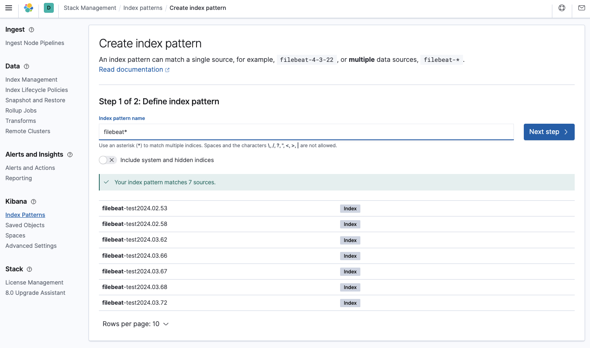
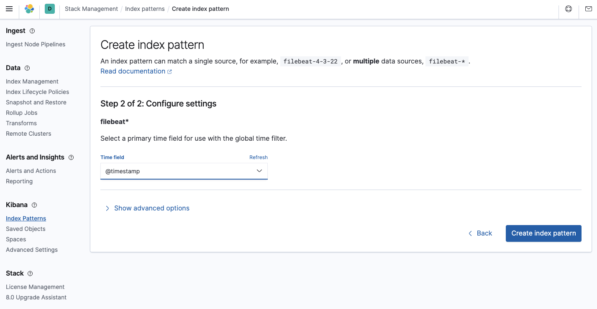

---

# ELK Lab with Filebeat

Welcome to the ELK (Elasticsearch, Logstash, Kibana) lab repository with Filebeat integration via Docker Compose. This lab provides a convenient environment for experimenting with log aggregation and visualization using the ELK stack.

## Prerequisites

Before getting started, ensure you have the following prerequisites installed:

- Docker: [Installation Guide](https://docs.docker.com/get-docker/)
- Docker Compose: [Installation Guide](https://docs.docker.com/compose/install/)

## Getting Started

1. Clone this repository to your local machine:

    ```bash
    git clone https://github.com/your-username/elk-lab.git
    ```

2. Navigate into the cloned directory:

    ```bash
    cd elk-lab
    ```

3. Run Docker Compose to start the ELK stack and Filebeat:

    ```bash
    docker-compose up -d
    ```

4. Access Kibana in your browser:

    ```
    http://localhost:5601
    ```

5. Start sending logs to Logstash using Filebeat. Make sure to configure Filebeat according to your environment.

6. Configure the ElasticSearch indices that can be displayed in Kibana.

You can use the pattern `filebeat*` to include all the logs coming from FileBeat:


You also need to define the field used as log timestamp. You should use `@timestamp` as shown below:


Now, you can visualize the logs generated by Elasticsearch, Logstash, Kibana, Filebeat and your other containers in kibana interface.

## Configuration

- `docker-compose.yaml`: This file defines the services for Elasticsearch, Logstash, Kibana, and Filebeat. You can adjust configurations such as volumes, ports, and environment variables in this file.
- `filebeat.docker.yml`: Configuration file for Filebeat. Customize this file to specify log paths, Logstash output, and any other required settings.

## Contributing

Contributions are welcome! If you find any issues or have suggestions for improvements, please feel free to open an issue or submit a pull request.

---